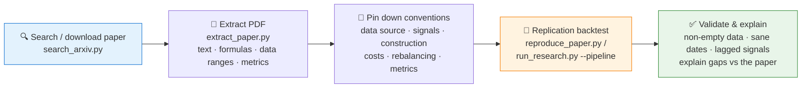

# 📄 Paper Replication Agent

[简体中文](README.md) | **English**

> Turns a quantitative finance paper (arXiv or local PDF) into a runnable, auditable replication experiment: search → extract → backtest → charts → metric comparison, fully framework-neutral.

<p align="center">
  
  
  
  
  
  
</p>

---

## 📖 What is this

`paper-replication` is a framework-neutral **Codex/Agent skill** for reproducing quantitative finance papers. It is not tied to any agent framework — as long as the target environment can read this directory and run local Python scripts, it can perform paper search, PDF extraction, formula and strategy-logic digestion, research backtesting, chart generation, and result packaging.

A third-party agent only needs to:

1. Read this directory.
2. Install `requirements.txt`.
3. Invoke scripts by their actual local path.
4. Write outputs under `/home/coder/project/replication/paper-replication/`, **not into the skill folder**.

## 🎯 Use Cases

- Reproduce quantitative finance papers from arXiv or local PDFs.
- Turn the paper's signals, portfolio construction, cost assumptions, and evaluation metrics into a runnable Pandas backtest.
- Experiment with akshare, yfinance, or user-provided CSV data.
- Output replication notes, metric JSON, equity/weight CSVs, and chart files for later review or report writing.
- Render chart-image text in English ASCII only so PNG/SVG output stays portable across systems without Chinese fonts.

## ⚡ Replication Pipeline



## 🚀 Quick Start

### 1️⃣ Install dependencies

```bash
python -m pip install -r /path/to/paper-replication/requirements.txt
```

No framework-specific install location is required. Use the actual local path to this skill directory.

### 2️⃣ Run the full pipeline with one command

```bash
python /path/to/paper-replication/scripts/run_research.py \
  --pipeline \
  --paper-id 2201.06635 \
  --symbols rb,if,au \
  --strategy tsmom
```

### 3️⃣ Output layout

Generated artifacts go under `/home/coder/project/replication/paper-replication/{paper_id}/`, never back into the skill directory:

```text
/home/coder/project/replication/paper-replication/{paper_id}/
  reports/{paper_id}.pdf                  # original paper
  reports/extracted_{paper_id}.md         # extracted paper content
  reports/metrics_{strategy}.json         # backtest metrics
  data/equity_{strategy}.csv              # equity curve
  data/weights_{strategy}.csv             # portfolio weights
  charts/chart_{strategy}.png             # charts
```

## 🧰 Single Steps

**Search arXiv:**

```bash
python /path/to/paper-replication/scripts/search_arxiv.py \
  "momentum futures" \
  --max 5 \
  --download
```

**Extract a PDF:**

```bash
python /path/to/paper-replication/scripts/extract_paper.py \
  --pdf /home/coder/project/replication/paper-replication/2201.06635/reports/2201.06635.pdf \
  --markdown \
  --output /home/coder/project/replication/paper-replication/2201.06635/reports/extracted_2201.06635.md
```

**Run standalone reproduction:**

```bash
python /path/to/paper-replication/scripts/reproduce_paper.py \
  --symbols rb,if,au \
  --strategy tsmom \
  --start 2020-01-01 \
  --end 2024-12-31 \
  --output-dir /home/coder/project/replication/paper-replication/2201.06635
```

## 🗃️ Data Sources

| Data | Source |
|---|---|
| 🇨🇳 Chinese futures | `akshare.futures_zh_daily_sina` |
| 🌍 International instruments | `yfinance` when needed |
| 📂 Custom paper datasets | CSV with required `date,open,high,low,close,volume` columns |

Always record the data source, requested date range, loaded date range, latest available date, and any stale-data caveat.

## ⚙️ Arguments

### `run_research.py`

| Argument | Default | Notes |
| --- | --- | --- |
| `--paper-id` | - | arXiv paper ID, e.g. `2201.06635` |
| `--paper` | - | arXiv search query |
| `--pdf` | - | Local PDF path |
| `--pipeline` | `false` | Run the full workflow |
| `--symbols` | `rb,if,au` | Comma-separated instruments |
| `--strategy` | `tsmom` | `tsmom`, `csmom`, `risk_parity`, `trend_vol` |
| `--start` | `2020-01-01` | Backtest start date |
| `--end` | `2024-12-31` | Backtest end date |
| `--target-vol` | `0.10` | Annual target volatility |
| `--skip-reproduce` | `false` | Skip standalone backtest |

### `reproduce_paper.py`

| Argument | Default | Notes |
| --- | --- | --- |
| `--symbols` | `rb,if,au` | Comma-separated instruments |
| `--strategy` | `tsmom` | `tsmom`, `csmom`, `risk_parity`, `trend_vol` |
| `--start` | `2020-01-01` | Start date |
| `--end` | `2024-12-31` | End date |
| `--target-vol` | `0.10` | Annual target volatility |
| `--cost` | `0.0001` | Transaction cost rate |
| `--capital` | `1000000` | Initial capital |
| `--output-dir` | `/home/coder/project/replication/paper-replication` | Output directory |

## ✅ Validation Checklist

- Confirm the loaded data is non-empty.
- Confirm the latest data date is not unexpectedly stale.
- Use shifted weights/signals to avoid look-ahead bias.
- Check generated JSON/CSV/PNG files are non-empty.
- Explain metric gaps against the paper instead of hiding them.

## 📜 License

This project is licensed under the GNU General Public License v3.0. See [LICENSE](LICENSE).

## 🐼 PandaAI / QUANTSKILLS Community

<div align="center">
  
  <br>
  <sub>Scan the QR code to join the PandaAI community for QUANTSKILLS skills, agent workflows, and quantitative research practice.</sub>
</div>
