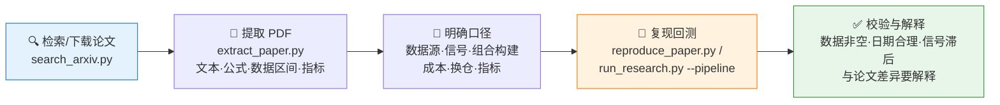

# 📄 Paper Replication Agent

**简体中文** | [English](README.en.md)

> 把一篇量化金融论文（arXiv 或本地 PDF），变成一套可运行、可审计的复现实验：检索 → 提取 → 回测 → 图表 → 指标对照，全程框架无关。

<p align="center">
  
  
  
  
  
  
</p>

---

## 📖 这是什么

`paper-replication` 是一个面向量化金融论文复现的 **Codex/Agent 技能包**。它不绑定特定智能体框架——只要目标环境可以读取本目录并运行本地 Python 脚本，就可以完成论文检索、PDF 提取、公式与策略逻辑整理、研究型回测、图表生成和结果打包。

第三方智能体只需要四步：

1. 读取本目录。
2. 安装 `requirements.txt`。
3. 按真实本地路径调用脚本。
4. 将输出写入 `/home/coder/project/replication/paper-replication/`，**不要写回技能目录**。

## 🎯 适用场景

- 复现 arXiv 或本地 PDF 中的量化金融论文。
- 将论文中的信号、组合构建、成本假设和评价指标转成可运行的 Pandas 回测。
- 使用 akshare、yfinance 或用户提供的 CSV 数据进行实验。
- 输出复现笔记、指标 JSON、净值/权重 CSV 和图表文件，便于后续审阅或报告撰写。
- 图表图片内部文字统一使用英文 ASCII，避免目标环境缺少中文字体时出现方块或乱码。

## ⚡ 复现流水线



## 🚀 快速开始

### 1️⃣ 安装依赖

```bash
python -m pip install -r /path/to/paper-replication/requirements.txt
```

不要求固定的框架专属安装位置，请使用该技能目录在本机上的真实路径。

### 2️⃣ 一条命令跑完整流程

```bash
python /path/to/paper-replication/scripts/run_research.py \
  --pipeline \
  --paper-id 2201.06635 \
  --symbols rb,if,au \
  --strategy tsmom
```

### 3️⃣ 输出结构

生成的产物统一放在 `/home/coder/project/replication/paper-replication/{paper_id}/`，不要写回 skill 目录本身：

```text
/home/coder/project/replication/paper-replication/{paper_id}/
  reports/{paper_id}.pdf                  # 原始论文
  reports/extracted_{paper_id}.md         # 提取的论文内容
  reports/metrics_{strategy}.json         # 回测指标
  data/equity_{strategy}.csv              # 净值曲线
  data/weights_{strategy}.csv             # 持仓权重
  charts/chart_{strategy}.png             # 图表
```

## 🧰 单步使用

**搜索 arXiv：**

```bash
python /path/to/paper-replication/scripts/search_arxiv.py \
  "momentum futures" \
  --max 5 \
  --download
```

**提取 PDF：**

```bash
python /path/to/paper-replication/scripts/extract_paper.py \
  --pdf /home/coder/project/replication/paper-replication/2201.06635/reports/2201.06635.pdf \
  --markdown \
  --output /home/coder/project/replication/paper-replication/2201.06635/reports/extracted_2201.06635.md
```

**运行独立复现：**

```bash
python /path/to/paper-replication/scripts/reproduce_paper.py \
  --symbols rb,if,au \
  --strategy tsmom \
  --start 2020-01-01 \
  --end 2024-12-31 \
  --output-dir /home/coder/project/replication/paper-replication/2201.06635
```

## 🗃️ 数据源

| 数据 | 来源 |
|---|---|
| 🇨🇳 中国期货 | `akshare.futures_zh_daily_sina` |
| 🌍 国际品种 | 需要时使用 `yfinance` |
| 📂 自定义数据集 | CSV 文件，需包含 `date,open,high,low,close,volume` 列 |

务必记录：数据源、请求日期范围、实际加载日期范围、最新可用日期，以及任何数据陈旧风险说明。

## ⚙️ 参数

### `run_research.py`

| 参数 | 默认值 | 说明 |
| --- | --- | --- |
| `--paper-id` | - | arXiv 论文 ID，例如 `2201.06635` |
| `--paper` | - | arXiv 搜索关键词 |
| `--pdf` | - | 本地 PDF 路径 |
| `--pipeline` | `false` | 运行完整流程 |
| `--symbols` | `rb,if,au` | 逗号分隔的交易品种 |
| `--strategy` | `tsmom` | `tsmom`、`csmom`、`risk_parity`、`trend_vol` |
| `--start` | `2020-01-01` | 回测开始日期 |
| `--end` | `2024-12-31` | 回测结束日期 |
| `--target-vol` | `0.10` | 年化目标波动率 |
| `--skip-reproduce` | `false` | 跳过独立回测 |

### `reproduce_paper.py`

| 参数 | 默认值 | 说明 |
| --- | --- | --- |
| `--symbols` | `rb,if,au` | 逗号分隔的交易品种 |
| `--strategy` | `tsmom` | `tsmom`、`csmom`、`risk_parity`、`trend_vol` |
| `--start` | `2020-01-01` | 开始日期 |
| `--end` | `2024-12-31` | 结束日期 |
| `--target-vol` | `0.10` | 年化目标波动率 |
| `--cost` | `0.0001` | 交易成本率 |
| `--capital` | `1000000` | 初始资金 |
| `--output-dir` | `/home/coder/project/replication/paper-replication` | 输出目录 |

## ✅ 校验清单

- 确认加载的数据非空。
- 确认最新数据日期没有异常陈旧。
- 使用滞后的权重或信号，避免未来函数。
- 检查生成的 JSON、CSV、PNG 文件非空。
- 如复现指标与论文存在差异，应解释原因，而不是隐藏差异。

## 📜 许可证

本项目使用 GNU General Public License v3.0。详见 [LICENSE](LICENSE)。
